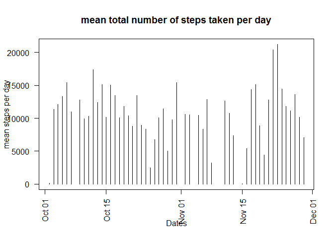
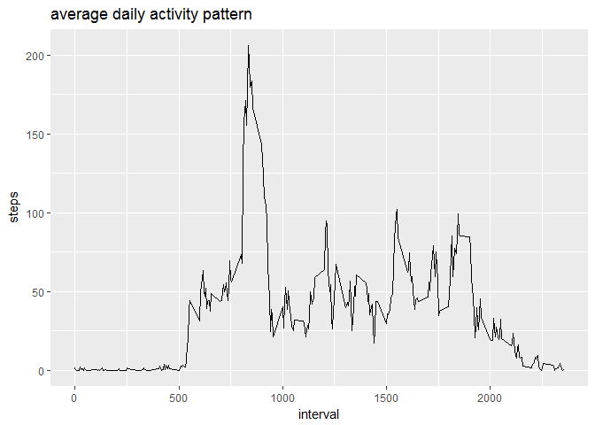
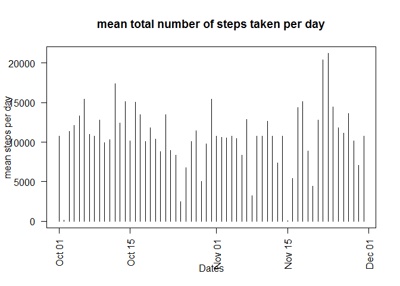
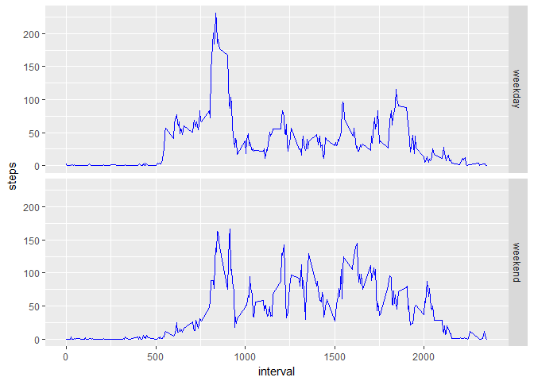

# Reproducible Research: Peer Assessment 1

## Loading and preprocessing the data

```r
#loading the data
activity <- read.csv(unzip("activity.zip"))

#processing the data
activity$date <- as.Date(activity$date,"%Y-%m-%d")
activity$interval <- as.factor(activity$interval)
```

## What is mean total number of steps taken per day?

```r
#histogram of the total number of steps taken each day
steps_day <- aggregate(steps~date,activity,sum, na.rm = TRUE)

plot(steps_day$date,steps_day$steps,las = 2, type = "h",main = "mean total number of steps taken per day", ylab = "mean steps per day", xlab = "Dates" )
```

<!-- -->

```r
#calculating mean and median
stpmean <- mean(steps_day$steps, na.rm = TRUE)
stpmedian <- median(steps_day$steps, na.rm = TRUE)
  print(paste("the mean of the total number of steps taken per day is ",stpmean))
```

```
## [1] "the mean of the total number of steps taken per day is  10766.1886792453"
```

```r
  print(paste("the median of the total number of steps taken per day is ",stpmedian))
```

```
## [1] "the median of the total number of steps taken per day is  10765"
```

## What is the average daily activity pattern?

```r
#loading ggplot2 library for plotting
library(ggplot2)
```

```
## Warning: package 'ggplot2' was built under R version 3.3.3
```

```r
#aggregation of steps by intervals of 5-minutes
act_intl<-activity
#act_intl$interval <- as.list(act_intl$interval)
act_intl <- aggregate(steps~interval, act_intl,mean)
act_intl$interval <- as.numeric(levels(act_intl$interval)[act_intl$interval])

#plotting
 g <- ggplot(act_intl, aes(interval,steps))
 g + geom_line() + ggtitle("average daily activity pattern")
```

<!-- -->

```r
#Which 5-minute interval, on average across all the days in the dataset, contains the maximum number of steps?
 max_step <- act_intl[which.max(act_intl$steps),]
print(paste("The interval",max_step$interval,"has maximum number of steps that is ", max_step$steps))
```

```
## [1] "The interval 835 has maximum number of steps that is  206.169811320755"
```
## Imputing missing values

```r
#Calculate and report the total number of missing values in the dataset (i.e. the total number of rows with NAs)
t <- table(is.na(activity))
print(paste("total number of missing values = ",t[2]))
```

```
## [1] "total number of missing values =  2304"
```

```r
# a strategy for filling in all of the missing values in the dataset
activity2 <- activity
nas <- is.na(activity2$steps)
avg_interval <- tapply(activity2$steps, activity2$interval, mean, na.rm=TRUE, simplify = TRUE)
activity2$steps[nas] <- avg_interval[as.character(activity2$interval[nas])]

#histogram of the total number of steps taken each day 
steps_day2 <- aggregate(steps~date,activity2,sum, na.rm = TRUE)

plot(steps_day2$date,steps_day2$steps,las = 2, type = "h",main = "mean total number of steps taken per day", ylab = "mean steps per day", xlab = "Dates" )
```

<!-- -->

```r
#comparison of mean and median total number of steps taken per day with (data  = steps_day) and without NA(steps_day2)
summary(steps_day)
```

```
##       date                steps      
##  Min.   :2012-10-02   Min.   :   41  
##  1st Qu.:2012-10-16   1st Qu.: 8841  
##  Median :2012-10-29   Median :10765  
##  Mean   :2012-10-30   Mean   :10766  
##  3rd Qu.:2012-11-16   3rd Qu.:13294  
##  Max.   :2012-11-29   Max.   :21194
```

```r
summary(steps_day2)
```

```
##       date                steps      
##  Min.   :2012-10-01   Min.   :   41  
##  1st Qu.:2012-10-16   1st Qu.: 9819  
##  Median :2012-10-31   Median :10766  
##  Mean   :2012-10-31   Mean   :10766  
##  3rd Qu.:2012-11-15   3rd Qu.:12811  
##  Max.   :2012-11-30   Max.   :21194
```

## Are there differences in activity patterns between weekdays and weekends?

```r
#new factor variable in the dataset with two levels -- "weekday" and "weekend" indicating whether a given date is a weekday or weekend day
activity2$weekd <- weekdays(activity2$date)
activity2$weekd <- ifelse( activity2$weekd %in% c("Saturday","Sunday"),"weekend","weekday")
activity2$weekd <- as.factor(activity2$weekd)

#plotting
act_week_int <- aggregate(steps~interval+weekd,activity2,mean)
act_week_int$interval <- as.numeric(levels(act_week_int$interval)[act_week_int$interval])
g <- ggplot(act_week_int, aes(interval, steps))
g+geom_line(col = "blue")+facet_grid(weekd~.)
```

<!-- -->

